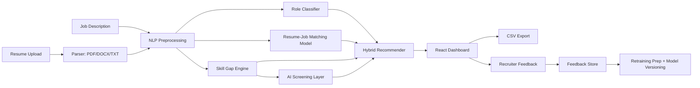

# AI Resume Screening System

A full-stack AI resume screening system built with FastAPI, React, Python, Scikit-learn, NLP, and ML. The project parses resumes, compares them against job descriptions, predicts candidate fit, highlights skill gaps, exports ranked results, stores recruiter feedback, and prepares feedback data for future retraining.

## Features

- PDF, DOCX, and TXT resume upload
- Resume text extraction and preprocessing
- Resume role prediction
- Resume-job matching model
- Skill extraction and skill-gap analysis
- Hybrid candidate ranking score
- Matched and missing skill highlighting
- Score visualization with pie and bar charts
- Minimum score and skill-based filtering
- CSV export to `outputs/`
- Recruiter feedback buttons
- Model status, model snapshots, and retraining preparation
- FastAPI backend with interactive Swagger docs
- React dashboard with clean card-based UI and dark/light mode

## Architecture



## Project Structure

```text
resume_screening_ml/
├── backend/
│   ├── api/
│   ├── services/
│   ├── main.py
│   └── requirements.txt
├── frontend/
│   ├── src/
│   ├── index.html
│   └── package.json
├── data/
│   ├── raw/
│   ├── processed/
│   └── feedback/
├── models/
│   └── versions/
├── outputs/
├── notebooks/
├── run_backend.bat
├── run_frontend.bat
└── run_all.bat
```

## Datasets

The system uses a multi-dataset pipeline.

| Dataset | Location | Purpose |
| --- | --- | --- |
| Resume Dataset | `data/raw/dataset_1_resumes/Resume.csv` | Resume understanding and role classification |
| Resume-Job Matching Dataset | `data/raw/dataset_2_resume_job_matching/train.csv` | Resume-job similarity and accept/reject prediction |
| AI Screening Dataset | `data/raw/dataset_3_ai_screening/AI_Resume_Screening.csv` | Skill extraction, AI score prediction, and recruiter decision logic |

Processed outputs:

```text
data/processed/resumes_cleaned.csv
data/processed/matching_cleaned.csv
data/processed/screening_cleaned.csv
```

Prepare datasets:

```bash
cd backend
python -m services.data_preparation
```

## Model Results

Current trained model results:

| Model Layer | Dataset | Key Result |
| --- | --- | --- |
| Resume role classifier | Dataset 1 | Test accuracy: 71.43%, test macro F1: 67.07%, 5-fold CV macro F1: 66.16% |
| Resume-job matcher | Dataset 2 balanced baseline | Test accuracy: 67.30%, test F1: 67.41%, test ROC-AUC: 73.31% |
| AI screening decision model | Dataset 3 | Accuracy: 94.00%, F1: 96.15%, ROC-AUC: 99.85%, 5-fold CV F1: 97.34% |
| AI score regressor | Dataset 3 | MAE: 2.62, RMSE: 3.90, R2: 96.56% |

The matching model was trained on a balanced sample of 10,000 accept rows and 10,000 reject rows because the original matching dataset is heavily imbalanced.

## Hybrid Ranking Score

Final candidate score:

```text
35% resume-job match probability
25% skill match score
25% AI screening score
15% role prediction confidence
```

Fit levels:

```text
85-100: Strong Fit
70-84:  Good Fit
55-69:  Moderate Fit
0-54:   Weak Fit
```

## Ranking Evaluation

The backend includes ranking evaluation metrics:

- MAP: Mean Average Precision
- NDCG: Normalized Discounted Cumulative Gain

Endpoint:

```text
POST /api/evaluate-ranking
```

Implementation:

```text
backend/services/evaluation.py
```

## API Endpoints

Run backend:

```bash
cd backend
python -m uvicorn main:app --host 127.0.0.1 --port 8000
```

Swagger docs:

```text
http://127.0.0.1:8000/docs
```

Main endpoints:

```text
GET  /health
POST /api/parse-resume
POST /api/recommend-upload
POST /api/recommend
POST /api/predict-role
POST /api/predict-match
POST /api/analyze-skills
POST /api/screen-candidate
POST /api/export-rankings
POST /api/feedback
GET  /api/model-status
POST /api/create-model-version
POST /api/retrain
POST /api/evaluate-ranking
```

## Frontend

Run frontend:

```bash
cd frontend
npm install
npm run dev
```

Dashboard:

```text
http://127.0.0.1:5173
```

The UI includes:

- Resume upload
- Job description input
- Ranked candidate cards
- Skill highlighting
- Pie chart for match vs gap
- Bar chart for skills
- Minimum score slider
- Has/matched/missing skill filters
- CSV export
- Feedback buttons
- Model operations panel

## Feedback and Retraining

Recruiter feedback is saved to:

```text
data/feedback/feedback.csv
```

Feedback labels:

```text
Good Match
Wrong Match
Hire
Reject
Correct Role
Wrong Role
```

Model snapshots are saved under:

```text
models/versions/
```

Registry metadata:

```text
models/model_registry.json
```

`POST /api/retrain` currently:

- Creates a pre-retraining model snapshot
- Reads recruiter feedback
- Converts usable feedback into processed feedback rows
- Prepares the next retraining cycle

Meaningful full retraining should be run after collecting enough validated feedback rows.

## Setup

Backend:

```bash
cd C:\ML_PROJECTS\resume_screening_ml\backend
python -m pip install -r requirements.txt
python -m services.data_preparation
python -m services.model
python -m services.matching_model --sample-per-class 10000
python -m services.screening_model
python -m uvicorn main:app --host 127.0.0.1 --port 8000
```

Frontend:

```bash
cd C:\ML_PROJECTS\resume_screening_ml\frontend
npm install
npm run dev
```

Or use:

```text
run_backend.bat
run_frontend.bat
run_all.bat
```

## Deployment

Recommended deployment:

```text
Backend: Render
Frontend: Vercel
```

### Backend on Render

The backend is deployment-ready with:

```text
backend/runtime.txt
backend/Procfile
render.yaml
```

Render Web Service settings:

```text
Root Directory: backend
Build Command: pip install -r requirements.txt
Start Command: uvicorn main:app --host 0.0.0.0 --port $PORT
```

Set this environment variable in Render after the Vercel frontend is deployed:

```text
PYTHON_VERSION=3.11.11
BACKEND_CORS_ORIGINS=https://resume-screening-ml-five.vercel.app
```

For local + deployed frontend access, use a comma-separated value:

```text
BACKEND_CORS_ORIGINS=http://localhost:5173,http://127.0.0.1:5173,https://resume-screening-ml-five.vercel.app
```

Health check:

```text
https://your-render-backend.onrender.com/health
```

### Frontend on Vercel

Vercel settings:

```text
Root Directory: frontend
Build Command: npm run build
Output Directory: dist
```

Set this environment variable in Vercel:

```text
VITE_API_BASE=https://your-render-backend.onrender.com
```

### Important Deployment Notes

The backend needs the trained model artifacts in `models/`:

```text
models/role_classifier.pkl
models/label_encoder.pkl
models/matching_tfidf_vectorizer.pkl
models/matching_model.pkl
models/screening_decision_model.pkl
models/screening_score_model.pkl
models/active_model.json
models/active_matching_model.json
models/active_screening_model.json
```

These files should be committed for a simple demo deployment. Do not commit the large raw datasets.

CSV feedback, exports, and snapshots are local-file based. On Render's normal filesystem, those generated files may not persist across redeploys/restarts unless you add a persistent disk or move storage to a database.

## Screenshot Checklist

Add screenshots for:

- Upload and job description screen
- Ranked result card
- Skill highlighting
- Pie/bar charts
- Skill filters
- CSV export success message
- Feedback buttons
- Model operations panel

Suggested folder:

```text
docs/screenshots/
```

## Future Scope

- Add full retraining from accumulated validated feedback
- Add model rollback from saved versions
- Add authentication for recruiter/admin workflows
- Add database persistence instead of CSV stores
- Add multilingual BERT embeddings for Dataset 2
- Add fairness and bias analysis
- Add explainability reports for each ranking
